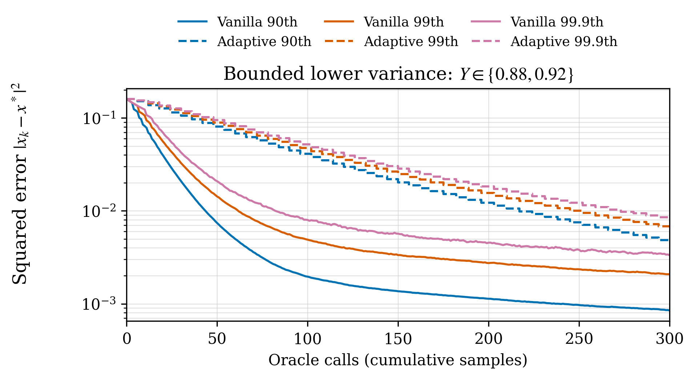
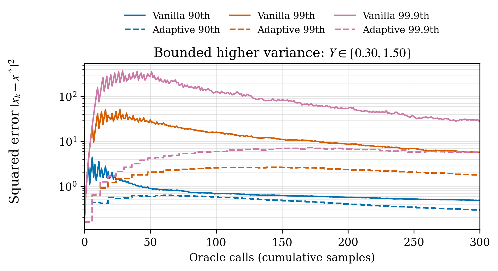
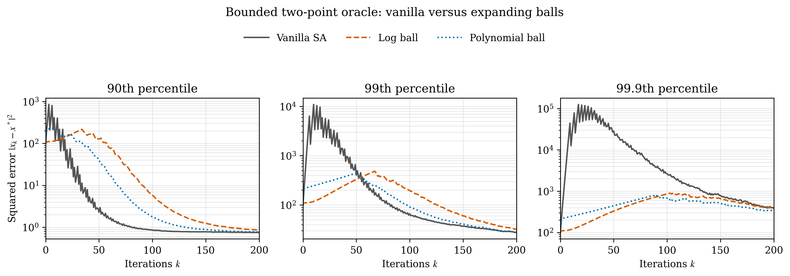
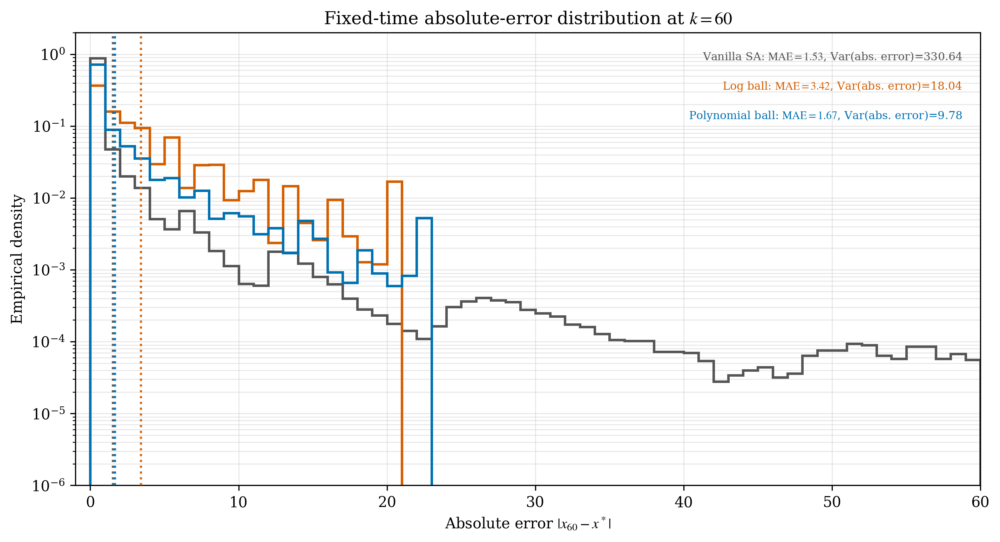

# Numerical experiments for *Bias versus Tail Concentration Tradeoffs for Stochastic Approximation Algorithms*

Reproducible, one-dimensional stochastic-approximation (SA) experiments with bounded two-point oracles. The notebook compares vanilla SA with adaptive sampling at equal oracle-call budgets, and with two expanding-ball projection schedules on matched sample paths.

## Contents

- [`stochastic_approximation_simulations.ipynb`](stochastic_approximation_simulations.ipynb): simulation code, mathematical setup, diagnostics, and embedded figures.
- [`figures/`](figures/): four generated PNG figures and an archive of the figures and CSV data.
- [`figures/tikz_csv/`](figures/tikz_csv/): four numerical tables for TikZ/PGFPlots.
- [`requirements.txt`](requirements.txt): numerical dependencies and JupyterLab.

## Run locally

Use Python 3.11 or newer (the numerical cells were validated with Python 3.12, NumPy 2.3.5, and Matplotlib 3.10.8).

```bash
git clone https://github.com/bulutboru/stochastic-approximation-simulations.git
cd stochastic-approximation-simulations
python -m venv .venv
source .venv/bin/activate  # Windows PowerShell: .venv\Scripts\Activate.ps1
python -m pip install -r requirements.txt
jupyter lab stochastic_approximation_simulations.ipynb
```

Restart the kernel and run all cells from top to bottom. The simulations need no external data or network access after installation. The full expanding-ball experiment uses 500,000 paths, so allow time for the simulations and quantile calculations. Figures and exports are regenerated under `figures/` when run from the repository root.

Alternatively, [open the notebook in Google Colab](https://colab.research.google.com/github/bulutboru/stochastic-approximation-simulations/blob/main/stochastic_approximation_simulations.ipynb). The final cell offers the figure/CSV archive as a download in Colab or as a local link in Jupyter.

## Model and methods

The oracle and its mean are

$$
F(x,Y)=Yx+(Y-0.9),\qquad \bar F(x)=0.9x,\qquad x^*=0.
$$

Vanilla SA uses

$$
x_{k+1}=x_k+\alpha_k\bigl(F(x_k,Y_{k+1})-x_k\bigr),
\qquad \alpha_k=\frac{60}{k+120}.
$$

Every oracle below puts probability one half on each support point. Since $F(x,Y)-\bar F(x)=(Y-0.9)(x+1)$, the noise satisfies $|F(x,Y)-\bar F(x)|\leq\sigma(1+|x|)$.

| Experiment | Support of $Y$ | Variance | $\sigma$ | Paths | Seed | Initial point | Budget / horizon |
| --- | --- | --- | --- | --- | --- | --- | --- |
| Lower-variance adaptive sampling | 0.88, 0.92 | 0.0004 | 0.02 | 100,000 | 1 | 0.4 | 300 oracle calls |
| Higher-variance adaptive sampling | 0.30, 1.50 | 0.36 | 0.6 | 100,000 | 1 | 0.4 | 300 oracle calls |
| Expanding balls and histogram | 0, 1.8 | 0.81 | 0.9 | 500,000 | 361 | 10 | 200 iterations; histogram at 60 |

### Adaptive sampling

At adaptive update $k$, average a batch of size

$$
N_k=\left\lceil 0.3(k+120)^{0.6}\right\rceil.
$$

Both methods consume the same realized oracle stream. Vanilla SA updates after each sample; adaptive SA updates only after a complete batch and is held constant between updates. The horizontal axis measures cumulative oracle calls, not adaptive updates. Each panel shows pointwise 90th, 99th, and 99.9th percentiles of squared error; these are not confidence bands or individual trajectories.

### Expanding-ball projections

Project each proposed update onto $[x_0-B_j,x_0+B_j]$, with center $x_0=10$ and $j=k+1$. For $j\geq1$, the two radii are

$$
B_j^{\log}=0.50+5.50\left[
\frac{\log((j+e)/(1+e))}{\log((40+e)/(1+e))}
\right]^4,
$$

$$
B_j^{\mathrm{poly}}=4.724839653079968
\left(\frac{j+120}{121}\right)^{2.50}.
$$

The “log ball” uses a **fourth-power logarithmic schedule**. The polynomial radius is larger over the displayed iterations 1–200. Vanilla SA and both projected methods use common random numbers; the histogram reuses the exact $k=60$ snapshot of the time-series simulation.

These schedules illustrate a finite-sample mean-error versus tail tradeoff: at the selected snapshot, vanilla SA has the lowest mean absolute error and the largest absolute-error variance. This is a result for the selected configuration, not a universal ordering of the algorithms or all error metrics.

## Figures

### 1. Lower-variance adaptive sampling

Solid curves denote vanilla SA; dashed curves denote adaptive sampling. Colors distinguish squared-error percentiles.



### 2. Higher-variance adaptive sampling

The same comparison and sample budget with higher oracle variance.



### 3. Vanilla SA versus expanding balls

Three panels show the pointwise squared-error percentiles through iteration 200. Gray solid: vanilla SA; orange dashed: log ball; blue dotted: polynomial ball.



### 4. Absolute-error distributions at iteration 60

The horizontal axis is **linear absolute error**, the vertical axis is **logarithmic empirical density**, and the color-matched vertical dotted lines mark **mean absolute error (MAE)**. The colored annotations report MAE and absolute-error variance. Statistics use all 500,000 paths per method.



Histogram bins cover absolute errors from 0 to 60 with width 1; the display extends left to −1 for padding. Observations above 60 are omitted from the visible bins, but density is normalized by the full sample count. The notebook reports the omitted probability mass. Zero-density bins cannot appear on the logarithmic vertical axis. Thus this panel does **not** display every observation.

Projection can create point masses at ball endpoints. The notebook reports endpoint masses and proposal boundary-hit rates. Both projections remain active at $k=60$; the last iterations with hit rates above 0.1% are 103 (log) and 87 (polynomial). “Effectively inactive” refers to this empirical threshold, not zero projection events or a pathwise guarantee.

### Snapshot statistics (all paths, $k=60$)

| Method | Mean absolute error | Variance of absolute error |
| --- | ---: | ---: |
| Vanilla SA | 1.53338 | 330.64289 |
| Polynomial ball | 1.67164 | 9.78088 |
| Log ball | 3.42015 | 18.03855 |

The histogram omits 0.2354% of vanilla observations above 60. All projected observations fit within the histogram window in this run.

## CSV exports and diagnostics

Each PNG has a corresponding CSV under `figures/tikz_csv/`:

| CSV | Horizontal coordinate | Data |
| --- | --- | --- |
| `bounded_low_variance_adaptive_vs_vanilla.csv` | `oracle_calls` | Vanilla/adaptive squared-error quantiles |
| `bounded_high_variance_adaptive_vs_vanilla.csv` | `oracle_calls` | Vanilla/adaptive squared-error quantiles |
| `bounded_vanilla_log_polynomial_balls.csv` | `iteration` | Squared-error quantiles for all three algorithms |
| `bounded_log_polynomial_absolute_error_histogram_k60.csv` | `absolute_error_edge` | Staircase densities and repeated MAE columns |

Quantile suffixes `q90`, `q99`, and `q999` mean 90%, 99%, and 99.9%, respectively. Histogram densities are repeated at both bin edges to preserve full bin widths with an ordinary PGFPlots `\addplot table`; zero densities are exported as `nan`. The three `*_mean_absolute_error` columns reproduce the vertical dotted lines. No raw sample paths are exported.

The last cell creates `figures/bounded_stochastic_approximation_figures_and_csv.zip`, containing the four PNGs and four CSVs. Printed histogram diagnostics include signed mean error, MAE, absolute empirical bias, signed- and absolute-error variances and standard deviations, central absolute-error widths, radii, omitted probability mass, and endpoint masses. Statistics are computed using all sample paths.

The supplied notebook contains assertions tailored to the selected seeds and schedules, including exact peak iterations. If parameters are changed for exploratory work, review those assertions and update the explanatory text accordingly.

## Citation

This code accompanies *Bias versus Tail Concentration Tradeoffs for Stochastic Approximation Algorithms*. Cite the manuscript together with an immutable GitHub release or commit. A GitHub release can also be archived with Zenodo to obtain a DOI.
